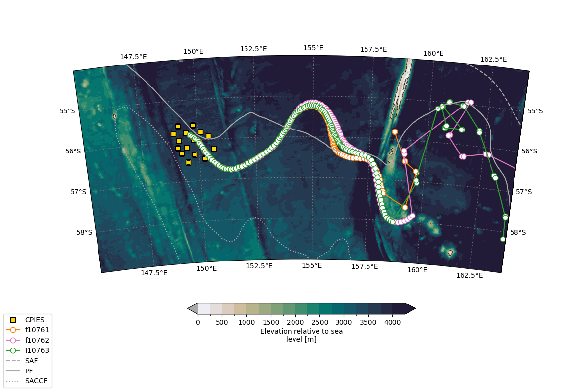
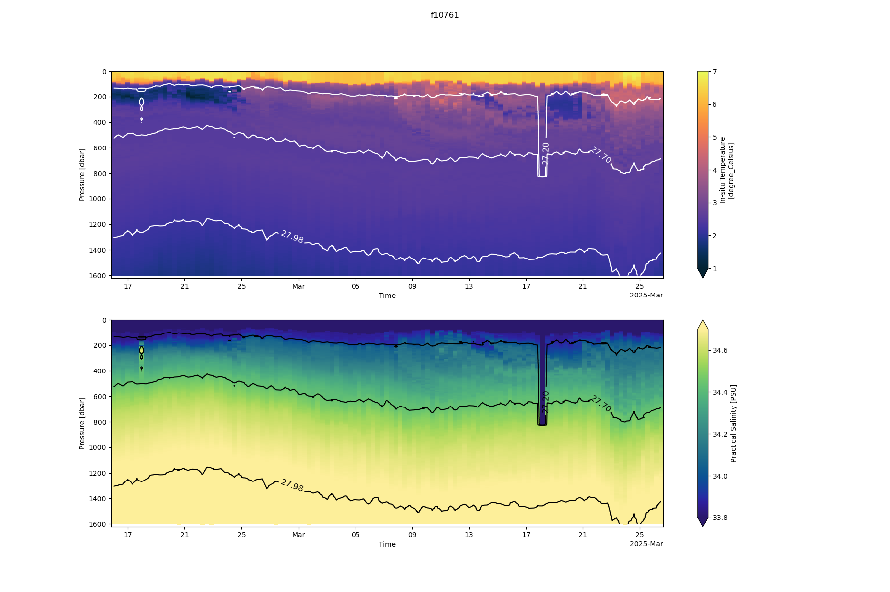
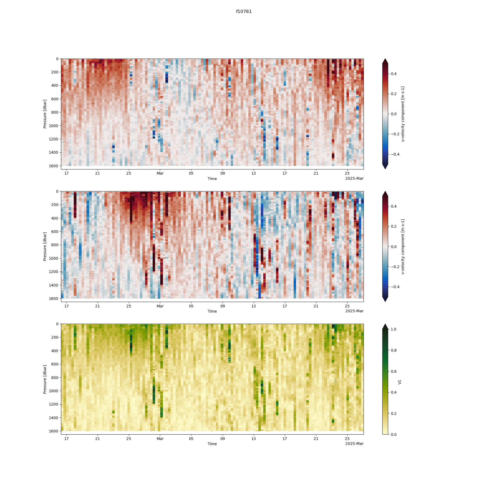

# EM-APEX floats seeded in the Antarctic Circumpolar Current's Polar Front near the South East Indian Ridge.

## Overview

Three EM-APEX (Electromagnetic Autonomous Profiling EXplorer) floats were seeded in the Polar Front of the Antarctic Circumpolar Current (ACC), downstream of the South East Indian Ridge (SEIR). The floats were deployed in the middle of a CPIES array put in place by the NSF (USA)–KOPRI (South Korea) Southern Ocean Fronts and Eddies (SOFE) project, providing coincident measurements of temperature, salinity, and horizontal velocity through the water column in a region of intense eddy activity and cross-frontal heat exchange.

EM-APEX floats extend the standard Argo APEX profiling float platform with an electromagnetic velocity sensor package, allowing estimation of horizontal current velocity and vertical shear from the motional-induction voltages generated as the float profiles through the water column — in addition to the standard temperature/salinity profiling that core Argo floats provide.

## Funding and project context

The EM-APEX floats were funded by the Australian Research Council (Discovery Project 24, *"Antarctica's leaky defence to poleward heat transport"*) and deployed as a collaboration with the NSF (USA)–KOPRI (South Korea) Southern Ocean Fronts and Eddies (SOFE) project, in the middle of SOFE's CPIES array.

- **Institution:** Institute for Marine and Antarctic Studies, University of Tasmania
- **Funding:** Australian Research Council, Discovery Project 24
- **Collaborating project:** Southern Ocean Fronts and Eddies (SOFE) — NSF (USA), KOPRI (South Korea)
- **Deployment context:** middle of SOFE's 16-CPIES array, ACC Polar Front, lee of the South East Indian Ridge

## Instrumentation

Each float carried the following sensors/devices:

| Sensor / device | Role |
|---|---|
| `seabird_ctd_41cp` | CTD — temperature, conductivity/salinity |
| `apluw_ema` | Electromagnetic velocity sensor (EM-APEX velocity package) |
| `iridium9523` | Iridium satellite communications |
| `gps15xh` | GPS positioning |

## Data processing and preprocessing scripts

Preprocessing scripts and data availability information are maintained at:
**https://github.com/southern-ocean-dynamics/ema-seir-pf**

> **Note:** this repository is work in progress, quality control steps for both the ctd and velocity data is still to be done

## NetCDF metadata conventions

Processed profile data are stored as NetCDF files.

### Variable attributes

Variable-level metadata (`standard_name`, `long_name`, `units`, and `comment` where relevant) is added according [CF Standard Name Table](https://cfconventions.org/Data/cf-standard-names/current/src/cf-standard-name-table.xml).

| Variable | `standard_name` | `long_name` | `units` | Notes |
|---|---|---|---|---|
| `T` | `sea_water_temperature` | In-situ Temperature | degree_Celsius | |
| `S` | `sea_water_practical_salinity` | Practical Salinity | PSU | Dimensionless (PSS-78) |
| `SA` | `sea_water_absolute_salinity` | Absolute Salinity | g kg-1 | TEOS-10 |
| `CT` | `sea_water_conservative_temperature` | Conservative Temperature | degree_Celsius | TEOS-10 |
| `pressure` / `p` | `sea_water_pressure` | Sea Water Pressure | dbar | |
| `gamman` | `sea_water_neutral_density` | Neutral Density | kg m-3 | Jackett and McDougall (1997) neutral density. |
| `u1`, `u2` | `eastward_sea_water_velocity` | u-velocity component | m s-1 | |
| `v1`, `v2` | `northward_sea_water_velocity` | v-velocity component | m s-1 | |
| `verr1`, `verr2` | — | — | — | Velocity error estimates |
| `time` | `time` | Time | — | |
| `latitude` | `latitude` | Latitude | degree_north | |
| `longitude` | `longitude` | Longitude | degree_east | |

## Figures

**Overview map**

**Temperature/salinity on pressure grid — float f10761**

**Velocity speed on pressure grid — float f10761**

## License and Citation

### Data

The EM-APEX float data in this repository are openly available for use under the [Creative Commons Attribution 4.0 International (CC BY 4.0)](https://creativecommons.org/licenses/by/4.0/) license. You are free to use, share, and adapt the data for any purpose, provided appropriate credit is given.

If you use this data, please cite it as:

> \[Meijer and Phillips], (2026). EM-APEX float profiles seeded in the ACC's Polar Front downstream of the South East Indian Ridge. \[Dataset]. Institute for Marine and Antarctic Studies, University of Tasmania. \[DOI/URL to be added]

### Code

The preprocessing scripts in this repository are made available under the [MIT License](https://opensource.org/licenses/MIT) and may be reused, modified, and redistributed for processing EM-APEX float data, with attribution appreciated.

### Companion publication

*A scientific paper describing this dataset and deployment is in preparation. Citation details (authors, journal, DOI) will be added here upon publication.*